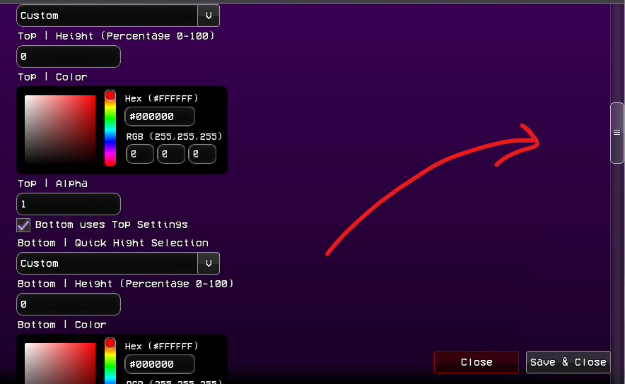
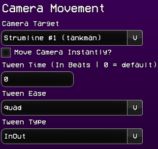
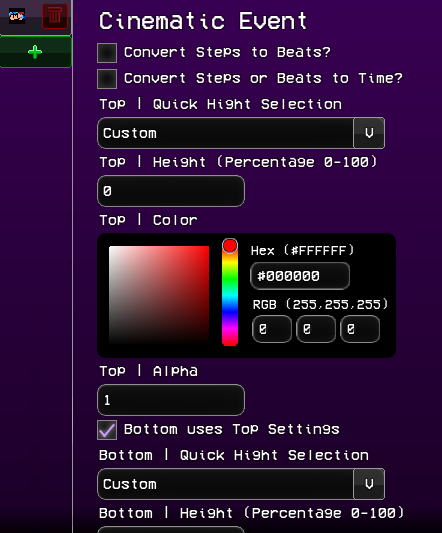
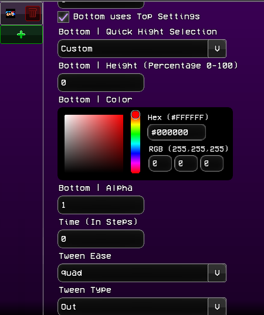
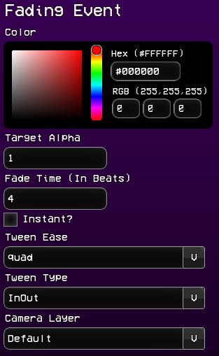
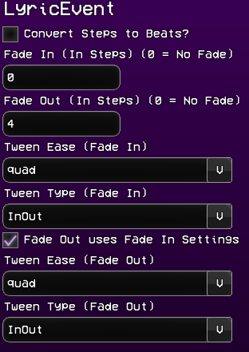
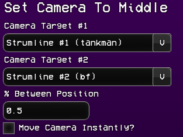
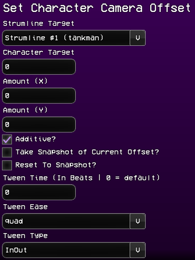
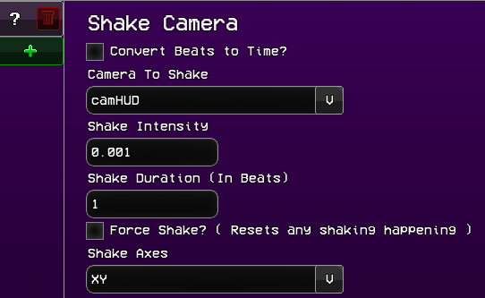
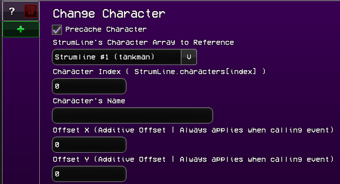

# LJ's Events Pack
Hi!!

## THIS IS A ADDON!!!
You can put it in `./addons/` OR THE NEW FEATURE `./mods/your-mod/addons/`!!

# DOWNLOAD THE `./data` AND `./images` FOLDER

Thanks for using my events pack, I hope you enjoy it!

## Additional Info:

Since some events might go past the height of the events screen (ahem Cinematic Event), I've added a scrolling feature.

You can use the scroll bar on the right or use the mouse wheel to scroll.

# Events:

    
<h3>Camera Movement</h3>

    
Edited the event so that you can make the camera instantly focus on a character. You can also tween to the character's position. Easing and Time.

    
Event parameters are exactly what they mean.

    

    
<h3>Change Camera Zoom</h3>

    
This changes the defaultCamZoom variable to be that value. You can also tween the value.

    
Instant - instantly changes the zoom value.

    
Additive - adds the value to the current zoom value.

    
Take Snapshot - saves the current zoom value to a snapshot. (A snapshot is taken on creation of PlayState)

    
Reset To Snapshot - resets the zoom value to the snapshot.

    
Time - The time in beats that the tween takes.

    
Tween Ease - ease function. (FlxEase)

    
Tween Type - ease type. (FlxEase)

    

    
<h3>Change Note Camera Movement</h3>

    
The event pack contains a script that moves the camera when a character is focused on and hits a note. Check out ./songs/ui_notecam.hx for more info.

    

    
<h3>Cinematic Event</h3>

    
This event shows 2 bars on the top and bottom. (Its rendered with one sprite!! check out the event .hx lol)

    
The time is in steps, but toggling Convert Steps to Beats or Convert Steps or Beats into Time will do exactly that.

    
Everything else is self explanatory.

    
    

    
<h3>Fading Event</h3>

    
Fading event can act like a flash event, but with more control the alpha, and time with tweens.

    
Events are self explanatory.

    

    
<h3>Lyric Event</h3>

    
This was made for Pillar Funkin! It's a bit complicated to explain here, but it uses a .json in `./songs/your-song/lyric.json`, you can find an example in `./github/`

    
Events are self explanatory.

    

    
<h3>Set Camera To Middle</h3>

    
This basically acts like the YoshiCrafterEngine's version of the % between 2 characters. Pick 2 strumline's characters, and the float will be point between them.

    
Events are self explanatory.

    

    
<h3>Set Character Camera Offset</h3>

    
This modifies the Character's camera position. You can also tween to the value as well.

    <!--  -->
    
Camera Target - The character index of the `strumLine.characters` array to edit.

    
Additive - Adds the value to the current camera offset.

    
Take Snapshot - Saves the camera's position value as a snapshot. (A snapshot is taken on creation of PlayState)

    
Reset To Snapshot - Resets the camera's position to the snapshot. (Per character!!)

    
Tween Time - The time in beats that the tween takes. If left at 0, camFollow's lerp will be used instead.

    
The rest is self explanatory.

    <!--  -->
    

    
<h3>Shake Camera</h3>

    
Shakes the camera, pretty self explanatory. You can do specific cameras, or all the cameras in the list of rendering cameras.

    

    
<h3>Change Character</h3>

    
This event, personally I won't use, because there is way better ways to do it than an event, but useful for those who can't code in Codename Engine.

    
The Character Index is based on the StrumLine's Characters array, so you can change any character.

    <!--  -->
    
Precaching the character just preloads the character to a map array. So if the character with the same name is already in the map, it will reference that character and load that one instead.

    <!--  -->
    
NOW THIS IS IMPORTANT BECAUSE PEOPLE DON'T UNDERSTAND THIS SOMEHOW!!

    
If you change the "x" or "y" param in the `data/character` XML, that is the Charatcer's GLOBAL position!!! This affects where the character is placed in ANY stage. So that's probably why when you switch characters, they are at an offset.

    <!--  -->
    
To counteract this, the Offset X and Offset Y params are there. They will always apply an offset when the event is called (unless the character you are switching to is already active).

    

## Events I plan to add in the future:

- [X] Character Change Event
- [ ] Stage Switch Event
- [ ] Cutscene Event
